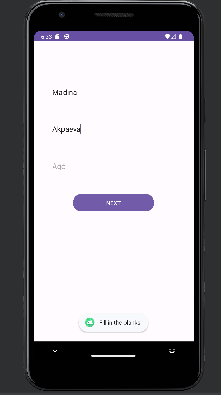
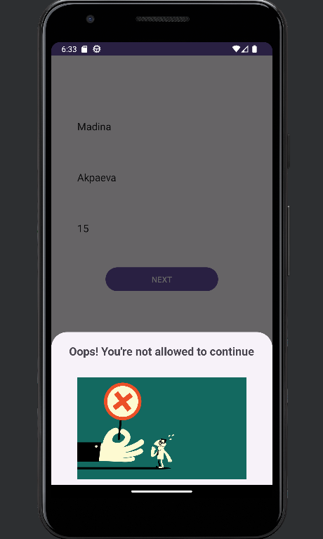
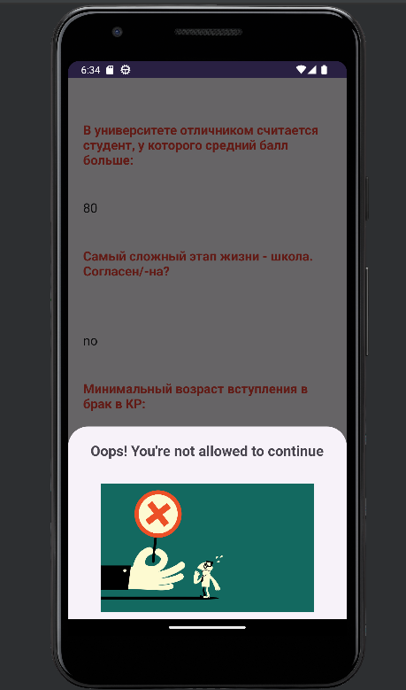
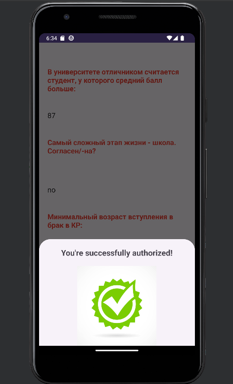

# BottomSheetDialogFragment
# First Fragment
## If you're over 18 y.o, you go to the next page. If not you'll get an error:

# Second Fragment
## There're three questions to check if you're really over 18 y.o., if you give incorrect answers, you'll get an error again:

## If your answer is correct get a message:

